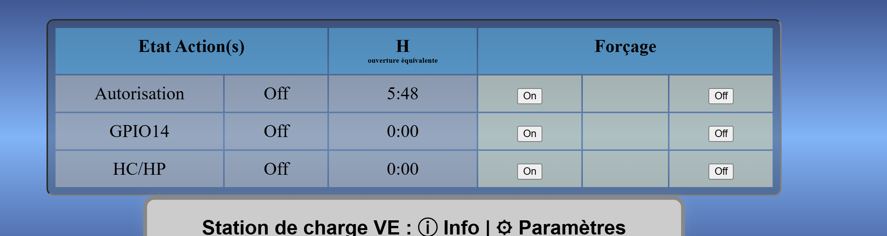
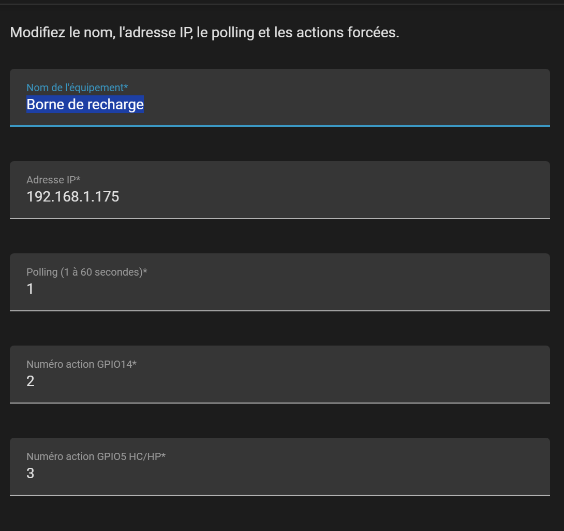
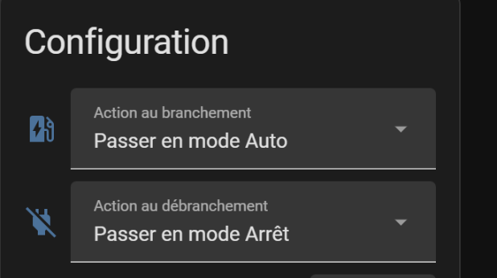
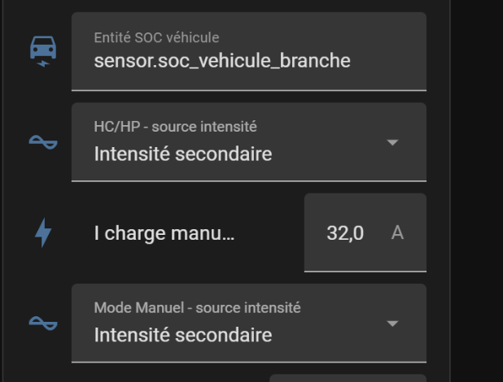

# Mode d’emploi — Intégration RMS VE

Ce guide explique la configuration de base de l’intégration **RMS VE** dans Home Assistant et le lien avec les actions configurées dans le routeur VE.

## 1. Préparer les actions dans le routeur VE

L’intégration utilise le **numéro d’ordre des actions** affichées dans le routeur VE.

Exemple :

| Action routeur VE | Ordre / numéro d’action | Utilisation dans l’intégration |
|---|---:|---|
| Autorisation | 1 | Action principale du routeur |
| GPIO14 | 2 | Intensité secondaire |
| HC/HP | 3 | Heures creuses / heures pleines |

> Le nom exact de l’action dans le routeur n’a pas d’importance. Ce qui compte est son **ordre d’affichage**.



## 2. Configuration initiale de l’intégration

Dans Home Assistant, ouvrez :

```text
Paramètres → Appareils et services → RMS VE → Reconfigurer
```

Renseignez les champs suivants :

| Champ | Rôle |
|---|---|
| Nom de l’équipement | Nom affiché dans Home Assistant |
| Adresse IP | Adresse IP locale du routeur VE |
| Polling | Fréquence d’interrogation du routeur, en secondes |
| Numéro action GPIO14 | Numéro d’ordre de l’action GPIO14 dans le routeur |
| Numéro action GPIO5 HC/HP | Numéro d’ordre de l’action HC/HP dans le routeur |

Exemple :



## 3. Actions au branchement et au débranchement

L’intégration permet de choisir automatiquement une action quand le véhicule est branché ou débranché.

Exemples :

| Situation | Action possible |
|---|---|
| Véhicule branché | Passer en Auto, Semi-auto, Manuel ou ne rien faire |
| Véhicule débranché | Passer en Arrêt, Auto ou ne rien faire |



## 4. SOC véhicule externe

Si une autre intégration fournit le pourcentage de batterie du véhicule, indiquez son entité dans le champ :

```text
Entité SOC véhicule
```

Exemple :

```text
sensor.soc_vehicule_branche
```

Cette valeur permet à RMS VE de connaître l’état de charge du véhicule branché.

## 5. Intensité principale ou secondaire

L’intégration permet de choisir quelle intensité utiliser pour certains comportements :

| Option | Signification |
|---|---|
| Intensité principale | Utilise le réglage normal du routeur |
| Intensité secondaire | Active le GPIO14 pour utiliser le second jeu d’intensité configuré dans le routeur |

Réglages disponibles :

- **Mode Manuel - source intensité**
- **HC/HP - source intensité**

Si **Intensité secondaire** est sélectionnée, l’intégration active automatiquement le GPIO14 lorsque le mode concerné est utilisé.



## 6. HC/HP

Pour utiliser la fonction heures creuses :

1. Configurez l’action HC/HP dans le routeur VE.
2. Renseignez son numéro dans l’intégration :

```text
Numéro action GPIO5 HC/HP
```

3. Activez l’interrupteur **Utiliser HC** dans Home Assistant.
4. Réglez l’heure creuse souhaitée.

À l’heure configurée, l’intégration active l’action HC/HP via le GPIO5.

## 7. Résumé rapide

Avant de tester, vérifiez :

- l’adresse IP du routeur VE est correcte ;
- les numéros d’action correspondent bien à l’ordre d’affichage dans le routeur ;
- GPIO14 est configuré dans le routeur si vous utilisez l’intensité secondaire ;
- GPIO5 / HC/HP est configuré si vous utilisez les heures creuses ;
- l’entité SOC véhicule est correcte si vous utilisez la charge jusqu’à un pourcentage cible.

